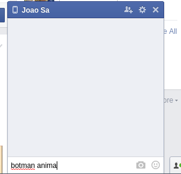
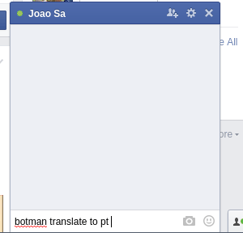
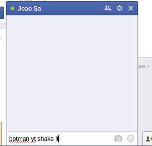
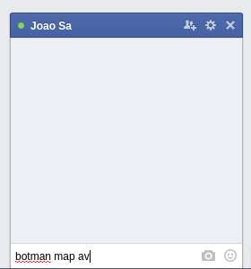
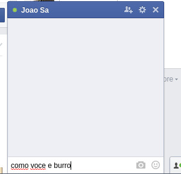
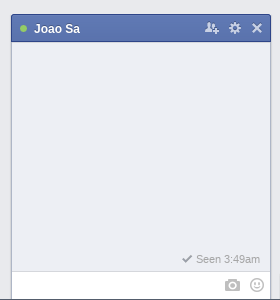

# botman

#### Botman is here to speed up those witty responses on Facebook


## Requirements

Compatible with

-    Firefox +   [Greasemonkey](https://addons.mozilla.org/en-US/firefox/addon/greasemonkey/)
-    Chrome +   [Tampermonkey](https://chrome.google.com/webstore/detail/tampermonkey/dhdgffkkebhmkfjojejmpbldmpobfkfo?hl=en)


## Installation

Get it [here](https://github.com/joaomsa/botman/raw/master/dist/botman.user.js)

## Known commands

### images

    - botman image (query) 
    - botman img (query) 
    - botman animate (query) 
    - botman gif (query) 
    
Returns a pertinent image or animated gif for the query from Google Images



### translate

    - botman translate from (lang) to (lang) (query)
    - botman translate to (lang) (query)
    - botman translate from (lang) (query)

Translate the query from the source language to to target language.
Source if not specified source language defaults to "auto" and target language to "english".



### youtube

    - botman yt (query)
    - botman youtube (query)

Returns the most relevant video for the query.



### maps

    - botman map (query)

Returns a google maps link to the queried location



### caetano

    - maneira burra
    - que loucura
    - como voce e burro
    - que coisa absurda

Caetano lays the smackdown, you really are that stupid.



### wow

    - wow

Doge is aware of very escalating amaze and auto replies



### rename

    - botman rename (new name)

Rename botman, make him your own, and from then on invoke him by his new name

## Contributing

Get started

-   Install node.js and grunt with `npm install -g grunt-cli`
-   Fork and clone your copy of the repo
-   Run `npm install` in the project root

Build

- Build with `grunt`
- Continuously build with `grunt watch`

### Extending

Adding new replies and commands to botman is straightforward

There are 3 types of commands that you can register with botman, each requires as parameters a capture RegExp to match against a sent or received message, and a callback that's executed when the capture is executed.

-   `hear(capture, callback)`

    Triggered when you attempt to send a message that matches the capture regex

-   `comply(capture, callback)`

    Same as hear, except requires that botman be called before matching the message text.

-   `reply(capture, callback)`

    Triggered when you receive a message that matches the capture reges

```js
// contain your excitement
robot.comply(/hi+/i, function(msg){
    msg.send("hi");
});
```

The callback when botman matches a registered command receives as an argument a Message object with the following properties:

-   `match`

    Array result of the regex match on message (useful for capturing arguments for your commands)

-   `target`

    Chatbox textarea HTMLElement from the conversation that triggered the callback.

And functions:

-   `body()`

    Body of the original message that triggered the conversation

-   `send(messageBody)`

    Immediately send a message

-   `replace(messageBody)`

    Replace all text in the chatbox textarea (useful for messages you want to evaluate or to trigger Facebook's link sharing parsing before sending)

Heavily inspired by [github/hubot](https://github.com/github/hubot)

Credits to [@gbmoretti](https://github.com/gbmoretti) for the idea :sparkling_heart:
