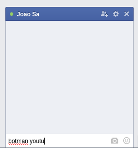

# botman

#### Botman is here to speed up those witty responses on Facebook

## Requirements

Compatible with

-    Firefox +   [Greasemonkey](https://addons.mozilla.org/en-US/firefox/addon/greasemonkey/)
-    Chrome +   [Tampermonkey](https://chrome.google.com/webstore/detail/tampermonkey/dhdgffkkebhmkfjojejmpbldmpobfkfo?hl=en)

## Installation

Get it [here](https://github.com/joaomsa/botman/raw/master/dist/botman.user.js)

## Known commands

### images

    - botman image (query) 
    - botman animate (query) 
    
Returns a pertinent image or animated gif for the query from Google Images

### maps

    - botman map (query)

Returns a google maps link to the queried location

### translate

    - botman translate from (lang) to (lang) (query)
    - botman translate to (lang) (query)
    - botman translate from (lang) (query)

Translate the query from the source language to to target language.
Source if not specified source language defaults to "auto" and target language to "english".

### youtube

    - botman yt (query)
    - botman youtube (query)

Returns the most relevant video for the query

## Contributing

Get started

-   Install node.js and grunt with `npm install -g grunt-cli`
-   Fork and clone your copy of the repo
-   Run `npm install` in the project root

Build

- Build with `grunt`
- Continuously build with `grunt watch`

Heavily inspired by [github/hubot](https://github.com/github/hubot)

Credits to [@gbmoretti](https://github.com/gbmoretti) for the idea :sparkling_heart:
